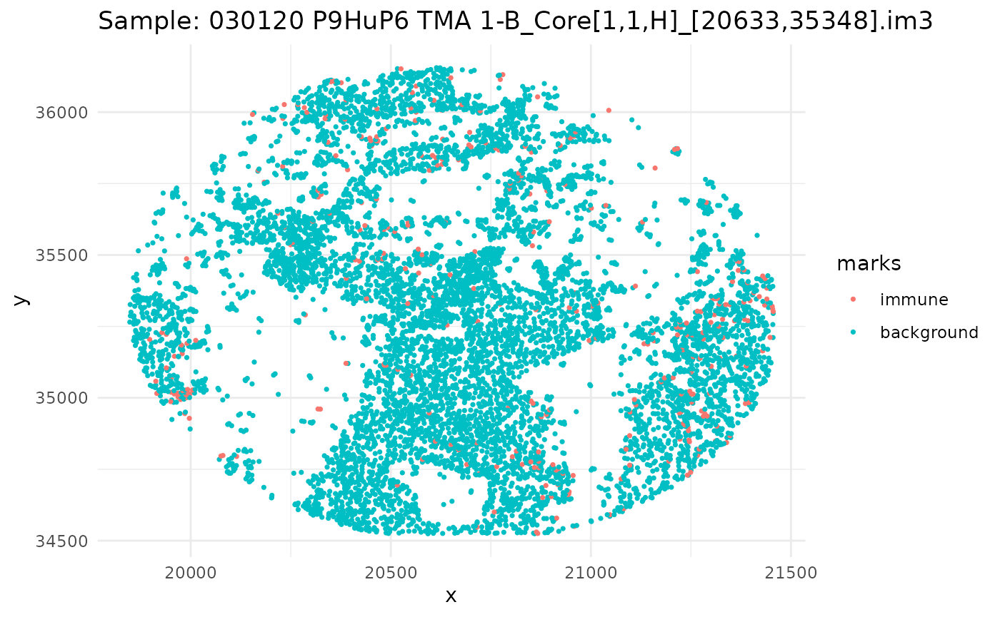
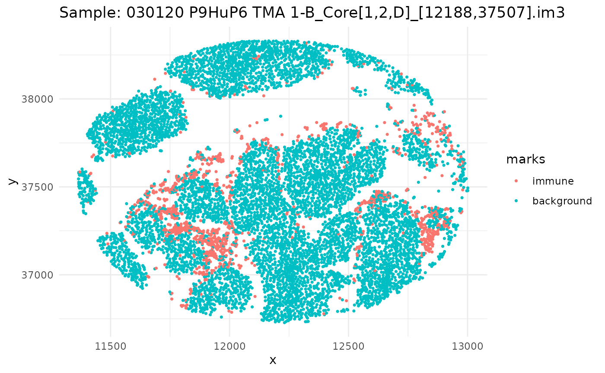
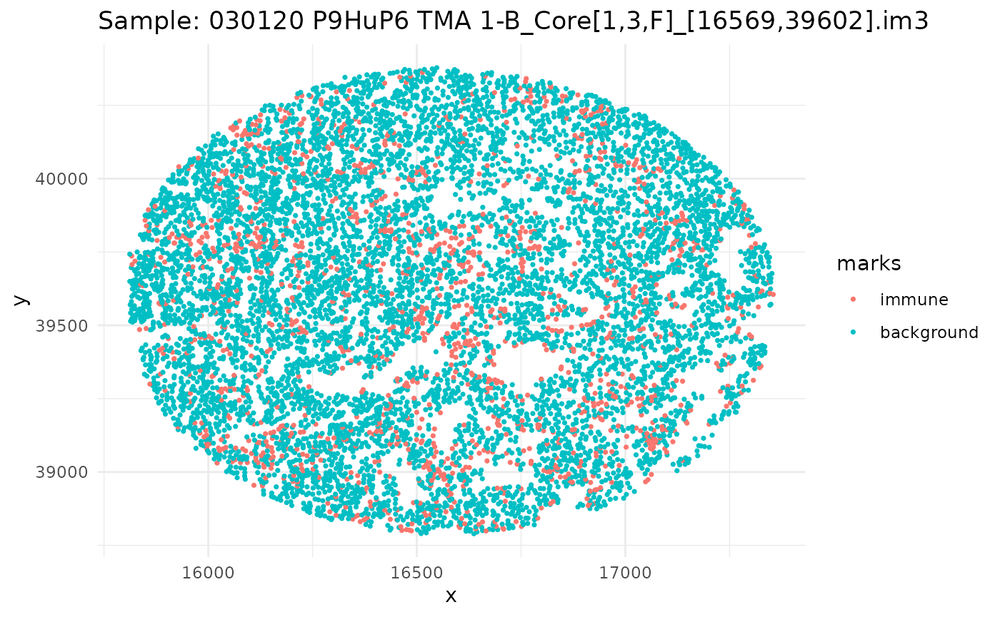
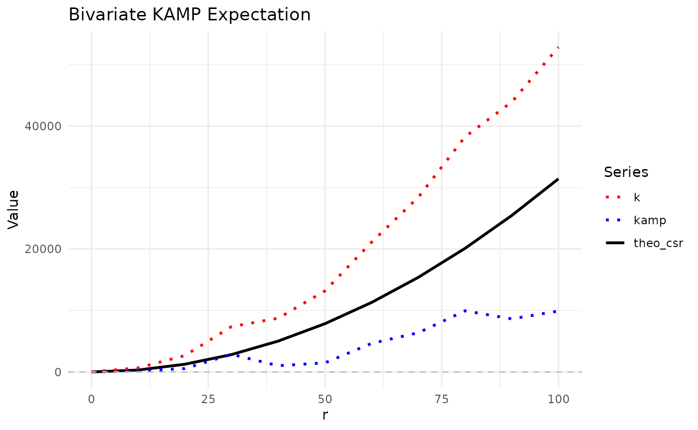
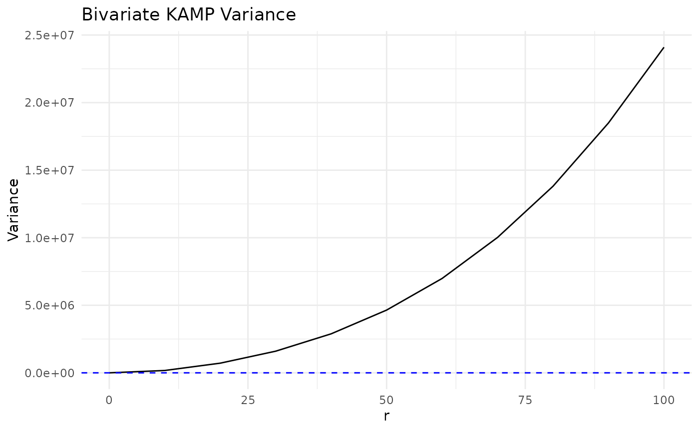
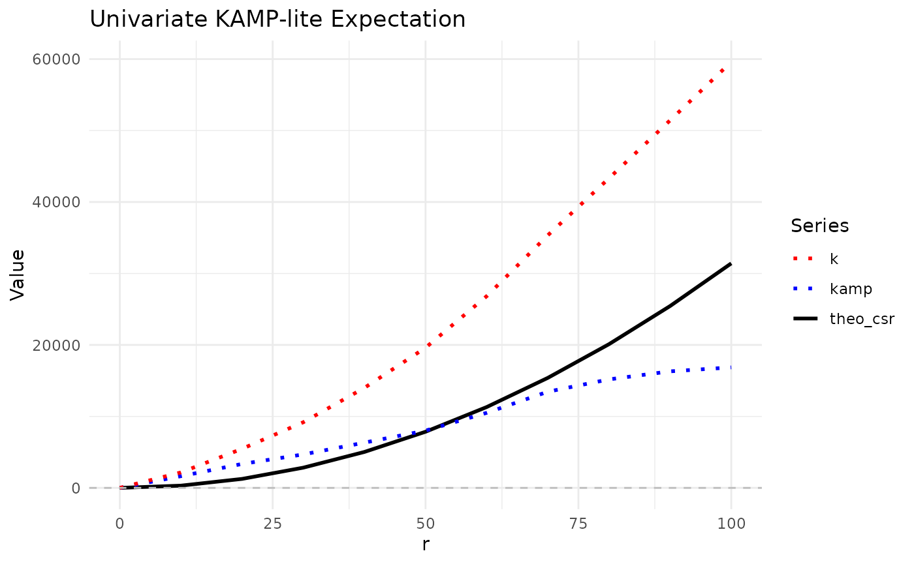
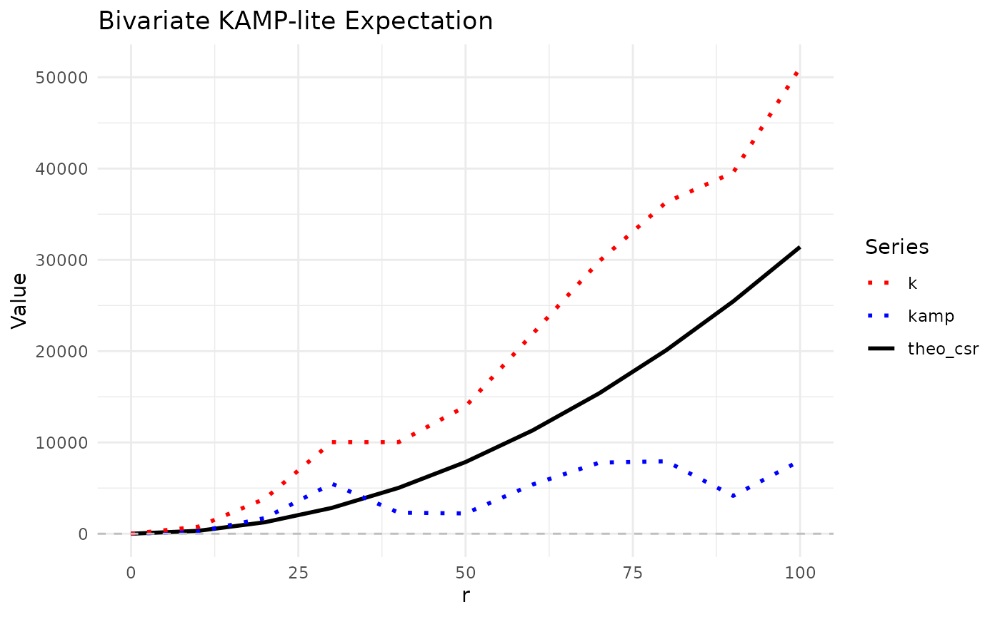

# KAMP

## Introduction

Hello and welcome to the `KAMP` package! This package is designed to
calculate the expectation and variance of KAMP (K adjustment by
Analytical Moments of the Permutation distribution) for point patterns
with marks. The package is partially built on the `spatstat` package,
which is a powerful tool for analyzing spatial data in R. The `KAMP`
package provides functions to simulate point patterns, calculate the
KAMP CSR, and visualize the results. The package is designed to be
user-friendly and easy to use, with a focus on providing clear and
concise output. The package is still in development, and we welcome any
feedback or suggestions for improvement. If you have any questions or
issues, please feel free to reach out to us.

## Before You Begin

A few concepts that come up throughout this vignette:

- **`ppp` object**: `spatstat`’s representation of a point pattern – a
  set of point locations (`x`/`y` coordinates) inside a bounding window,
  optionally with a `marks` attribute labeling each point (e.g. by cell
  type). [`kamp()`](https://dliao1.github.io/KAMP/reference/kamp.md) can
  build one for you from a plain data.frame, or you can pass one in
  directly.

- **Ripley’s K function**: A measure of spatial clustering. For a given
  radius `r`, K(r) roughly captures the expected number of additional
  points within distance `r` of a typical point, normalized by point
  density. Values higher than expected under randomness indicate
  clustering; lower values indicate dispersion (points spread out more
  than expected).

- **Complete spatial randomness (CSR)**: The null hypothesis that points
  are distributed independently and uniformly at random. The
  *theoretical* K under CSR (`theo_csr`) assumes a homogeneous point
  density across the whole window – an assumption that’s often violated
  in real tissue images (e.g. due to holes, folds, or regions with no
  cells).

- **KAMP**: Rather than comparing observed K only to the theoretical CSR
  baseline, KAMP computes the expectation and variance of K under a
  *permutation* null – what you’d see if the marks were randomly
  reassigned among the existing point locations. This adapts to the
  actual inhomogeneity of the tissue. KAMP computes this permutation
  distribution’s moments analytically (in closed form) instead of by
  simulating many permutations, so it stays fast even on large datasets.

## Setup

``` r

library(KAMP)
#library(devtools)
library(tidyverse)
#> ── Attaching core tidyverse packages ──────────────────────── tidyverse 2.0.0 ──
#> ✔ dplyr     1.2.1     ✔ readr     2.2.0
#> ✔ forcats   1.0.1     ✔ stringr   1.6.0
#> ✔ ggplot2   4.0.3     ✔ tibble    3.3.1
#> ✔ lubridate 1.9.5     ✔ tidyr     1.3.2
#> ✔ purrr     1.2.2     
#> ── Conflicts ────────────────────────────────────────── tidyverse_conflicts() ──
#> ✖ dplyr::filter() masks stats::filter()
#> ✖ dplyr::lag()    masks stats::lag()
#> ℹ Use the conflicted package (<http://conflicted.r-lib.org/>) to force all conflicts to become errors
library(spatstat.random)
#> Loading required package: spatstat.data
#> Loading required package: spatstat.univar
#> spatstat.univar 3.2-0
#> Loading required package: spatstat.geom
#> spatstat.geom 3.8-2
#> spatstat.random 3.5-1
#devtools::load_all()
set.seed(50)
```

## Quick Start

Here’s the whole workflow in a few lines, before we walk through it in
more detail below: load the data, subset to a single image, and compute
the KAMP expectation.

``` r

data(ovarian_df)
one_sample <- ovarian_df %>% filter(sample_id == unique(sample_id)[1])

quick_kamp <- kamp(df = one_sample,
                   rvals = seq(0, 100, by = 10),
                   univariate = TRUE,
                   mark_var = "immune",
                   mark1 = "immune")
#> We expect the dataframe to be a single point process. If you have multiple point processes, subset the dataframe by ID and please run KAMP separately for each process.
quick_kamp
#> # A tibble: 11 × 5
#>        r      k theo_csr kamp_csr   kamp
#>    <dbl>  <dbl>    <dbl>    <dbl>  <dbl>
#>  1     0     0        0        0      0 
#>  2    10  2338.     314.     521.  1817.
#>  3    20  5855.    1257.    2108.  3747.
#>  4    30 10460.    2827.    4527.  5933.
#>  5    40 14735.    5027.    7727.  7008.
#>  6    50 20228.    7854.   11713.  8515.
#>  7    60 27485.   11310.   16472. 11013.
#>  8    70 35859.   15394.   22039. 13820.
#>  9    80 43814.   20106.   28302. 15511.
#> 10    90 52296.   25447.   35277. 17019.
#> 11   100 60732.   31416.   42914. 17818.
```

`k` is the observed K for the “immune” cells at each radius `r`, and
`kamp_csr` is KAMP’s adjusted null expectation for that same radius. The
rest of this vignette walks through what these numbers mean, how to
visualize them, and how to run bivariate and large-scale (KAMP-lite)
analyses.

## Ovarian Dataset

The `ovarian_df` dataset is a small dataframe that contains a snapshot
of 5 images of ovarian cancer cells from the `HumanOvarianCancerVP()`
dataset in the `VectraPolarisData` package. Each image is represented by
a unique sample ID, and within each image, there are multiple cells with
their respective x and y coordinates. The dataset includes an `immune`
column that indicates whether the cell is an immune cell or a background
cell. There is also a `phenotype` column that indicates the type of
cell, with levels “helper t cell”, “cytotoxic t cell”, “b cell”,
“macrophage”, “tumor”, and “other”. The `x` and `y` columns represent
the coordinates of the cells in the image.

``` r

data(ovarian_df)
head(ovarian_df)
#>   cell_id                                           sample_id       x       y
#> 1       1 030120 P9HuP6 TMA 1-B_Core[1,1,H]_[20633,35348].im3 20592.9 34524.4
#> 2       2 030120 P9HuP6 TMA 1-B_Core[1,1,H]_[20633,35348].im3 20859.3 34524.4
#> 3       3 030120 P9HuP6 TMA 1-B_Core[1,1,H]_[20633,35348].im3 20591.4 34530.4
#> 4       4 030120 P9HuP6 TMA 1-B_Core[1,1,H]_[20633,35348].im3 20744.7 34528.9
#> 5       5 030120 P9HuP6 TMA 1-B_Core[1,1,H]_[20633,35348].im3 20419.8 34540.8
#> 6       6 030120 P9HuP6 TMA 1-B_Core[1,1,H]_[20633,35348].im3 20741.7 34542.3
#>       immune phenotype
#> 1 background     other
#> 2 background     other
#> 3 background     tumor
#> 4 background     tumor
#> 5 background     other
#> 6 background     tumor
```

Since we have a dataframe of multiple images, let’s go through, subset
our dataframe by id, and plot it.

``` r

ids <- unique(ovarian_df$sample_id)
mark_var <- "immune"

for (id in ids) {
  df_sub <- ovarian_df %>% filter(sample_id == id)
  w <- convexhull.xy(df_sub$x, df_sub$y)
  pp_obj <- ppp(df_sub$x, df_sub$y, window = w, marks = df_sub[[mark_var]])
  
  p <- ggplot(as_tibble(pp_obj), aes(x, y, color = marks)) +
    geom_point(size = 0.6) +
    labs(title = paste("Sample:", id)) +
    theme_minimal()
  
  print(p)
}
```



## KAMP

Now that we have our data, we can use the
[`kamp()`](https://dliao1.github.io/KAMP/reference/kamp.md) function to
calculate the KAMP expectation and variance for both univariate and
bivariate data.

### Univariate

We can use the
[`kamp()`](https://dliao1.github.io/KAMP/reference/kamp.md) function to
calculate the KAMP expectation for univariate data.

The [`kamp()`](https://dliao1.github.io/KAMP/reference/kamp.md) function
has several parameters that allow us to customize the calculation:

- `df`: Either a point pattern object created using the
  [`ppp()`](https://rdrr.io/pkg/spatstat.geom/man/ppp.html) function
  from the `spatstat` package, or a plain data.frame with `x`/`y`
  columns and a marks column (in which case `mark_var` is required).

- `rvals`: A sequence of distances at which to calculate the K function.

- `univariate`: A logical value indicating whether to calculate the
  univariate K function (default is `TRUE`).

- `mark_var`: The name of the marks column in `df`, when `df` is a
  data.frame. Ignored when `df` is already a `ppp` object.

- `mark1`: The value of the marks variable for the first mark (required
  for univariate).

- `mark2`: The value of the marks variable for the second mark (optional
  for univariate).

- `variance`: A logical value indicating whether to calculate the
  variance (default is `FALSE`).

- `correction`: The edge correction to use – `"trans"`/`"translational"`
  (the default), `"iso"`/`"isotropic"`, or `"none"`.

- `thin`: A logical value indicating whether to use thinning (default is
  `FALSE`).

- `p_thin`: Percentage to thin by (default is `0.5`).

For univariate data, we only need to specify one marks variable. In this
case, we set `univariate = TRUE` and `variance = FALSE` (the default).

- `univariate = TRUE` calculates the K function for one mark versus
  background.

- `variance = FALSE` means we only compute the expectation.

- `correction` uses translational correction by default.

**Choosing a correction:** edge correction matters because points near
the window’s boundary have fewer visible neighbors than points in the
interior, which can bias K downward at larger radii if left uncorrected.

- `"trans"`/`"translational"` (the default): a good default for most
  cases; reweights each pair of points by how much the window overlaps
  with itself when shifted by their separation vector.
- `"iso"`/`"isotropic"`: another commonly-used correction; can behave
  differently for irregularly-shaped windows and is more computationally
  expensive.
- `"none"`: no correction at all – fastest option, but biased whenever
  edge effects aren’t negligible (e.g. large `r` relative to the
  window’s size, or a small/irregular window).

#### Subsetting Data

To perform univariate analysis, we can subset our `ovarian_df` dataframe
to include only the first image ID and the `immune` marks variable.

``` r

ids <- unique(ovarian_df$sample_id)
univ_data <- ovarian_df %>% filter(sample_id == ids[1])
mark_var <- "immune"
head(univ_data)
#>   cell_id                                           sample_id       x       y
#> 1       1 030120 P9HuP6 TMA 1-B_Core[1,1,H]_[20633,35348].im3 20592.9 34524.4
#> 2       2 030120 P9HuP6 TMA 1-B_Core[1,1,H]_[20633,35348].im3 20859.3 34524.4
#> 3       3 030120 P9HuP6 TMA 1-B_Core[1,1,H]_[20633,35348].im3 20591.4 34530.4
#> 4       4 030120 P9HuP6 TMA 1-B_Core[1,1,H]_[20633,35348].im3 20744.7 34528.9
#> 5       5 030120 P9HuP6 TMA 1-B_Core[1,1,H]_[20633,35348].im3 20419.8 34540.8
#> 6       6 030120 P9HuP6 TMA 1-B_Core[1,1,H]_[20633,35348].im3 20741.7 34542.3
#>       immune phenotype
#> 1 background     other
#> 2 background     other
#> 3 background     tumor
#> 4 background     tumor
#> 5 background     other
#> 6 background     tumor
```

#### Expectation

We can now calculate the KAMP expectation for the univariate data using
the [`kamp()`](https://dliao1.github.io/KAMP/reference/kamp.md)
function. What we are doing here is calculating the KAMP expectation for
the `immune` marks variable against the background cells, using a
sequence of distances from 0 to 100 with a step of 10. Furthermore, we
use the option `univariate = TRUE` and specify the marks variable for
the first mark as `mark1 = "immune"` - we are not setting `mark2` since
we are only interested in the univariate case.

What’s returned is a data frame with the following columns:

- `r`: The distance at which the K function is calculated.

- `k`: The K function value.

- `theo_csr`: The theoretical CSR (Complete Spatial Randomness) value.

- `kamp_csr`: The KAMP CSR value.

- `kamp`: The difference between K and the KAMP CSR.

``` r

univ_kamp <- kamp(univ_data, 
                  rvals = seq(0, 100, by = 10),
                  univariate = TRUE,
                  mark_var = mark_var,
                  mark1 = "immune")
#> We expect the dataframe to be a single point process. If you have multiple point processes, subset the dataframe by ID and please run KAMP separately for each process.

univ_kamp
#> # A tibble: 11 × 5
#>        r      k theo_csr kamp_csr   kamp
#>    <dbl>  <dbl>    <dbl>    <dbl>  <dbl>
#>  1     0     0        0        0      0 
#>  2    10  2338.     314.     521.  1817.
#>  3    20  5855.    1257.    2108.  3747.
#>  4    30 10460.    2827.    4527.  5933.
#>  5    40 14735.    5027.    7727.  7008.
#>  6    50 20228.    7854.   11713.  8515.
#>  7    60 27485.   11310.   16472. 11013.
#>  8    70 35859.   15394.   22039. 13820.
#>  9    80 43814.   20106.   28302. 15511.
#> 10    90 52296.   25447.   35277. 17019.
#> 11   100 60732.   31416.   42914. 17818.
```

We can visualize KAMP using `ggplot2`. Plotted here is the original K
from translational edge correctionm, the theoretical CSR, and the KAMP
CSR. The KAMP CSR is the expected value of K under the null hypothesis
of CSR, which is calculated using the analytical moments of the
permutation distribution.

``` r

univ_kamp %>%
  ggplot(aes(x = r)) +
  geom_line(aes(y = theo_csr, color = "theo_csr", linetype = "theo_csr"), linewidth = 1) +
  geom_line(aes(y = kamp_csr, color = "kamp_csr", linetype = "kamp_csr"), linewidth = 1) +
  geom_line(aes(y = k, color = "k", linetype = "k"), linewidth = 1) +
  geom_hline(yintercept = 0, linetype = "dashed", color = "gray") +
  scale_color_manual(
    values = c(
      "theo_csr" = "black",
      "kamp_csr" = "blue",
      "k" = "red"
    )
  ) +
  scale_linetype_manual(
    values = c(
      "theo_csr" = "solid",
      "kamp_csr" = "solid",
      "k" = "dotted"
    )
  ) +
  labs(
    title = "Univariate KAMP Expectation",
    x = "r",
    y = "Value",
    color = "Series",
    linetype = "Series"
  ) +
  theme_minimal()
```


Looking at the plot, we can see that the KAMP CSR (blue line) is
slightly higher than the theoretical CSR (black line) at larger
distances. This result aligns with our expectations, as, if we view the
plots of the first sample image, the first image is more inhomogenous -
i.e. there are large holes/“patches” of empty space that could make the
immune cells appear more clustered than expected under CSR.

Let’s plot the differences between k and the theo_csr and kamp_csr to
get a better idea:

``` r

univ_kamp %>%
  ggplot(aes(x = r)) +
  geom_line(aes(y = k - kamp_csr, color = "k - kamp_csr", linetype = "k - kamp_csr"), linewidth = 1) +
  geom_line(aes(y = k - theo_csr, color = "k - theo_csr", linetype = "k - theo_csr"), linewidth = 1) +
  geom_hline(yintercept = 0, linetype = "dashed", color = "gray") +
  scale_color_manual(
    values = c(
      "k - theo_csr" = "red",
      "k - kamp_csr" = "blue"
    )
  ) +
  scale_linetype_manual(
    values = c(
      "k - theo_csr" = "solid",
      "k - kamp_csr" = "solid"
    )
  ) +
  labs(
    title = "Univariate KAMP Expectation - differences",
    x = "r",
    y = "Value",
    color = "Series",
    linetype = "Series"
  ) +
  theme_minimal()
```


As expected, the difference between k and the theoretical CSR values
tended to be higher than the difference between k and the KAMP CSR
values, indicating that the KAMP CSR seems to do a better job accounting
for the inhomogenous tissue quality.

#### Variance

To calculate the variance of the KAMP expectation, we still use the
kamp() function, but we set `variance = TRUE`. This will compute the
variance of the KAMP expectation at each distance `r`. The new output
will include all the same columns as before, but with additional column
`var` that contains the variance of the KAMP expectation at each
distance, and a `p-val` column that contains the p-value for the
variance test.

**Note:** `variance = TRUE` is not compatible with `thin = TRUE`. If
both are set to TRUE, a warning will be thrown and variance will still
be calculated, but the results may be unreliable.

``` r

univ_kamp_var <- kamp(univ_data,
                      rvals = seq(0, 100, by = 10),
                      univariate = TRUE,
                      mark_var = mark_var,
                      mark1 = "immune",
                      variance = TRUE)
#> We expect the dataframe to be a single point process. If you have multiple point processes, subset the dataframe by ID and please run KAMP separately for each process.
univ_kamp_var
#> # A tibble: 11 × 7
#>        r      k theo_csr kamp_csr   kamp      var     pvalue
#>    <dbl>  <dbl>    <dbl>    <dbl>  <dbl>    <dbl>      <dbl>
#>  1     0     0        0        0      0        0  NaN       
#>  2    10  2337.     314.     522.  1815.   18654.   1.37e-40
#>  3    20  5847.    1257.    2105.  3742.   79757.   2.23e-40
#>  4    30 10435.    2827.    4515.  5920.  189378.   1.89e-42
#>  5    40 14687.    5027.    7698.  6989.  364776.   2.87e-31
#>  6    50 20139.    7854.   11654.  8485.  626577.   4.16e-27
#>  7    60 27325.   11310.   16367. 10958. 1006029.   4.38e-28
#>  8    70 35593.   15394.   21863. 13730. 1533400.   7.21e-29
#>  9    80 43423.   20106.   28027. 15396. 2230285.   3.19e-25
#> 10    90 51744.   25447.   34870. 16874. 3136488.   8.04e-22
#> 11   100 59996.   31416.   42340. 17656. 4259010.   5.87e-18
```

We can visualize the variance of the KAMP expectation using `ggplot2`:

``` r

#devtools::load_all()

univ_kamp_var %>%
  ggplot(aes(x = r, y = var)) +
  geom_line() +
  geom_hline(yintercept = 0, linetype = "dashed", color = "blue") +
  labs(title = "Univariate KAMP Variance", x = "r", y = "Variance") +
  theme_minimal()
```


### Bivariate

#### Subsetting Data

For bivariate analysis, we can subset our `ovarian_df` dataframe to
include two types of immune cells and background cells. In this example,
we will use “helper t cells” and “cytotoxic t cells”.

``` r

ids <- unique(ovarian_df$sample_id)
biv_data <- ovarian_df %>% 
  filter(sample_id == ids[1]) #%>%
#filter(phenotype %in% c("helper t cells", "cytotoxic t cells", "other")) %>%
#droplevels()

mark_var <- "phenotype"

head(biv_data)
#>   cell_id                                           sample_id       x       y
#> 1       1 030120 P9HuP6 TMA 1-B_Core[1,1,H]_[20633,35348].im3 20592.9 34524.4
#> 2       2 030120 P9HuP6 TMA 1-B_Core[1,1,H]_[20633,35348].im3 20859.3 34524.4
#> 3       3 030120 P9HuP6 TMA 1-B_Core[1,1,H]_[20633,35348].im3 20591.4 34530.4
#> 4       4 030120 P9HuP6 TMA 1-B_Core[1,1,H]_[20633,35348].im3 20744.7 34528.9
#> 5       5 030120 P9HuP6 TMA 1-B_Core[1,1,H]_[20633,35348].im3 20419.8 34540.8
#> 6       6 030120 P9HuP6 TMA 1-B_Core[1,1,H]_[20633,35348].im3 20741.7 34542.3
#>       immune phenotype
#> 1 background     other
#> 2 background     other
#> 3 background     tumor
#> 4 background     tumor
#> 5 background     other
#> 6 background     tumor
```

#### Expectation

To calculate the KAMP expectation for bivariate data, we set
`univariate = FALSE` and specify the marks variables for both marks.

``` r


biv_kamp <- kamp(df = biv_data,
                 rvals = seq(0, 100, by = 10),
                 univariate = FALSE,
                 mark_var = mark_var,
                 mark1 = "helper t cell",
                 mark2 = "cytotoxic t cell")
#> We expect the dataframe to be a single point process. If you have multiple point processes, subset the dataframe by ID and please run KAMP separately for each process.
head(biv_kamp)
#> # A tibble: 6 × 5
#>       r      k theo_csr kamp_csr  kamp
#>   <dbl>  <dbl>    <dbl>    <dbl> <dbl>
#> 1     0     0        0        0     0 
#> 2    10   663.     314.     521.  142.
#> 3    20  2667.    1257.    2108.  559.
#> 4    30  7386.    2827.    4527. 2859.
#> 5    40  8745.    5027.    7727. 1017.
#> 6    50 13191.    7854.   11713. 1478.
```

``` r

biv_kamp %>%
  ggplot(aes(x = r)) +
  geom_line(aes(y = theo_csr, color = "theo_csr", linetype = "theo_csr"), linewidth = 1) +
  geom_line(aes(y = kamp, color = "kamp", linetype = "kamp"), linewidth = 1) +
  geom_line(aes(y = k, color = "k", linetype = "k"), linewidth = 1) +
  geom_hline(yintercept = 0, linetype = "dashed", color = "gray") +
  scale_color_manual(
    values = c(
      "theo_csr" = "black",
      "kamp" = "blue",
      "k" = "red"
    )
  ) +
  scale_linetype_manual(
    values = c(
      "theo_csr" = "solid",
      "kamp" = "dotted",
      "k" = "dotted"
    )
  ) +
  labs(
    title = "Bivariate KAMP Expectation",
    x = "r",
    y = "Value",
    color = "Series",
    linetype = "Series"
  ) +
  theme_minimal()
```



#### Variance

``` r

biv_kamp_var <- kamp(df = biv_data,
                     rvals = seq(0, 100, by = 10),
                     univariate = FALSE,
                     mark_var = mark_var,
                     mark1 = "helper t cell",
                     mark2 = "cytotoxic t cell",
                     variance = TRUE)
#> We expect the dataframe to be a single point process. If you have multiple point processes, subset the dataframe by ID and please run KAMP separately for each process.
head(biv_kamp_var)
#> # A tibble: 6 × 7
#>       r      k theo_csr kamp_csr  kamp      var   pvalue
#>   <dbl>  <dbl>    <dbl>    <dbl> <dbl>    <dbl>    <dbl>
#> 1     0     0        0        0     0        0  NaN     
#> 2    10   663.     314.     522.  140.  172784.   0.368 
#> 3    20  2663.    1257.    2105.  558.  714201.   0.254 
#> 4    30  7361.    2827.    4515. 2846. 1601329.   0.0123
#> 5    40  8712.    5027.    7698. 1014. 2886001.   0.275 
#> 6    50 13126.    7854.   11654. 1472. 4643398.   0.247
```

``` r

biv_kamp_var %>%
  ggplot(aes(x = r, y = var)) +
  geom_line() +
  geom_hline(yintercept = 0, linetype = "dashed", color = "blue") +
  labs(title = "Bivariate KAMP Variance", x = "r", y = "Variance") +
  theme_minimal()
```



## KAMP-lite (Thinning)

KAMP-lite refers to running KAMP with a thinned point pattern using
`thin = TRUE` and specifying `p_thin` between 0 and 1. This helps with
performance on large datasets.

### Univariate

#### Expectation

``` r

ids <- unique(ovarian_df$sample_id)
mark_var <- "immune"
univ_data <- ovarian_df %>% filter(sample_id == ids[1])

univ_kamp_lite <- kamp(df = univ_data,
                       rvals = seq(0, 100, by = 10),
                       univariate = TRUE,
                       mark_var = mark_var,
                       mark1 = "immune",
                       thin = TRUE,
                       p_thin = 0.3)
#> We expect the dataframe to be a single point process. If you have multiple point processes, subset the dataframe by ID and please run KAMP separately for each process.
univ_kamp_lite
#> # A tibble: 11 × 5
#>        r      k theo_csr kamp_csr   kamp
#>    <dbl>  <dbl>    <dbl>    <dbl>  <dbl>
#>  1     0     0        0        0      0 
#>  2    10  2162.     314.     524.  1638.
#>  3    20  5468.    1257.    2118.  3350.
#>  4    30  9179.    2827.    4499.  4680.
#>  5    40 13995.    5027.    7664.  6331.
#>  6    50 19611.    7854.   11600.  8011.
#>  7    60 26824.   11310.   16325. 10499.
#>  8    70 35349.   15394.   21893. 13456.
#>  9    80 43318.   20106.   28137. 15181.
#> 10    90 51432.   25447.   35125. 16307.
#> 11   100 59610.   31416.   42752. 16858.
```

``` r

univ_kamp_lite %>%
  ggplot(aes(x = r)) +
  geom_line(aes(y = theo_csr, color = "theo_csr", linetype = "theo_csr"), linewidth = 1) +
  geom_line(aes(y = kamp, color = "kamp", linetype = "kamp"), linewidth = 1) +
  geom_line(aes(y = k, color = "k", linetype = "k"), linewidth = 1) +
  geom_hline(yintercept = 0, linetype = "dashed", color = "gray") +
  scale_color_manual(
    values = c(
      "theo_csr" = "black",
      "kamp" = "blue",
      "k" = "red"
    )
  ) +
  scale_linetype_manual(
    values = c(
      "theo_csr" = "solid",
      "kamp" = "dotted",
      "k" = "dotted"
    )
  ) +
  labs(
    title = "Univariate KAMP-lite Expectation",
    x = "r",
    y = "Value",
    color = "Series",
    linetype = "Series"
  ) +
  theme_minimal()
```



#### Variance

``` r

univ_kamp_lite_var <- kamp(df = univ_data,
                           rvals = seq(0, 100, by = 10),
                           univariate = TRUE,
                           mark_var = mark_var,
                           mark1 = "immune",
                           thin = TRUE,
                           p_thin = 0.3,
                           variance = TRUE) # should display a warning message
#> We expect the dataframe to be a single point process. If you have multiple point processes, subset the dataframe by ID and please run KAMP separately for each process.
#> Variance calculation is not supported with KAMP lite
#> Variance calculation with KAMP lite is not recommended. Variance will still be computed, but interpret with caution.
univ_kamp_lite_var
#> # A tibble: 11 × 7
#>        r      k theo_csr kamp_csr   kamp      var     pvalue
#>    <dbl>  <dbl>    <dbl>    <dbl>  <dbl>    <dbl>      <dbl>
#>  1     0     0        0        0      0        0  NaN       
#>  2    10  1963.     314.     530.  1433.   41397.   9.45e-13
#>  3    20  6070.    1257.    2108.  3961.  171792.   6.01e-22
#>  4    30 11157.    2827.    4526.  6630.  397368.   3.56e-26
#>  5    40 16355.    5027.    7716.  8639.  738918.   4.57e-24
#>  6    50 20857.    7854.   11676.  9181. 1226994.   5.74e-17
#>  7    60 27564.   11310.   16356. 11208. 1903377.   2.26e-16
#>  8    70 35531.   15394.   21849. 13683. 2823443.   1.93e-16
#>  9    80 42889.   20106.   28007. 14882. 3990433.   4.67e-14
#> 10    90 51187.   25447.   34869. 16319. 5484783.   1.61e-12
#> 11   100 59364.   31416.   42392. 16973. 7342327.   1.88e-10
```

### Bivariate

``` r

ids <- unique(ovarian_df$sample_id)
biv_data <- ovarian_df %>% 
  filter(sample_id == ids[1]) #%>%
#filter(phenotype %in% c("helper t cell", "cytotoxic t cell", "other")) %>%
#droplevels()

mark_var <- "phenotype"

head(biv_data)
#>   cell_id                                           sample_id       x       y
#> 1       1 030120 P9HuP6 TMA 1-B_Core[1,1,H]_[20633,35348].im3 20592.9 34524.4
#> 2       2 030120 P9HuP6 TMA 1-B_Core[1,1,H]_[20633,35348].im3 20859.3 34524.4
#> 3       3 030120 P9HuP6 TMA 1-B_Core[1,1,H]_[20633,35348].im3 20591.4 34530.4
#> 4       4 030120 P9HuP6 TMA 1-B_Core[1,1,H]_[20633,35348].im3 20744.7 34528.9
#> 5       5 030120 P9HuP6 TMA 1-B_Core[1,1,H]_[20633,35348].im3 20419.8 34540.8
#> 6       6 030120 P9HuP6 TMA 1-B_Core[1,1,H]_[20633,35348].im3 20741.7 34542.3
#>       immune phenotype
#> 1 background     other
#> 2 background     other
#> 3 background     tumor
#> 4 background     tumor
#> 5 background     other
#> 6 background     tumor
```

#### Expectation

``` r

biv_kamp_lite <- kamp(df = biv_data,
                      rvals = seq(0, 100, by = 10),
                      univariate = FALSE,
                      mark_var = mark_var,
                      mark1 = "helper t cell",
                      mark2 = "cytotoxic t cell",
                      thin = TRUE,
                      p_thin = 0.3)
#> We expect the dataframe to be a single point process. If you have multiple point processes, subset the dataframe by ID and please run KAMP separately for each process.
head(biv_kamp_lite)
#> # A tibble: 6 × 5
#>       r      k theo_csr kamp_csr  kamp
#>   <dbl>  <dbl>    <dbl>    <dbl> <dbl>
#> 1     0     0        0        0     0 
#> 2    10   759.     314.     528.  231.
#> 3    20  3830.    1257.    2115. 1715.
#> 4    30 10028.    2827.    4543. 5484.
#> 5    40 10028.    5027.    7720. 2308.
#> 6    50 13948.    7854.   11725. 2223.
```

``` r

biv_kamp_lite %>%
  ggplot(aes(x = r)) +
  geom_line(aes(y = theo_csr, color = "theo_csr", linetype = "theo_csr"), linewidth = 1) +
  geom_line(aes(y = kamp, color = "kamp", linetype = "kamp"), linewidth = 1) +
  geom_line(aes(y = k, color = "k", linetype = "k"), linewidth = 1) +
  geom_hline(yintercept = 0, linetype = "dashed", color = "gray") +
  scale_color_manual(
    values = c(
      "theo_csr" = "black",
      "kamp" = "blue",
      "k" = "red"
    )
  ) +
  scale_linetype_manual(
    values = c(
      "theo_csr" = "solid",
      "kamp" = "dotted",
      "k" = "dotted"
    )
  ) +
  labs(
    title = "Bivariate KAMP-lite Expectation",
    x = "r",
    y = "Value",
    color = "Series",
    linetype = "Series"
  ) +
  theme_minimal()
```



#### Variance

``` r

biv_kamp_lite_var <- kamp(df = biv_data,
                          rvals = seq(0, 100, by = 10),
                          univariate = FALSE,
                          mark_var = mark_var,
                          mark1 = "helper t cell",
                          mark2 = "cytotoxic t cell",
                          variance = TRUE,
                          thin = TRUE,
                          p_thin = 0.3) # should display a warning message
#> We expect the dataframe to be a single point process. If you have multiple point processes, subset the dataframe by ID and please run KAMP separately for each process.
#> Variance calculation is not supported with KAMP lite
#> Variance calculation with KAMP lite is not recommended. Variance will still be computed, but interpret with caution.
head(biv_kamp_lite_var)
#> # A tibble: 6 × 7
#>       r      k theo_csr kamp_csr   kamp      var  pvalue
#>   <dbl>  <dbl>    <dbl>    <dbl>  <dbl>    <dbl>   <dbl>
#> 1     0     0        0        0     0         0  NaN    
#> 2    10     0      314.     524. -524.   365704.   0.807
#> 3    20  2102.    1257.    2135.  -32.5 1519302.   0.511
#> 4    30  6337.    2827.    4597. 1740.  3382062.   0.172
#> 5    40  7760.    5027.    7801.  -41.3 5969226.   0.507
#> 6    50 14199.    7854.   11803. 2397.  9457495.   0.218
```

``` r

biv_kamp_lite_var %>%
  ggplot(aes(x = r, y = var)) +
  geom_line() +
  geom_hline(yintercept = 0, linetype = "dashed", color = "blue") +
  labs(title = "Bivariate KAMP lite Variance", x = "r", y = "Variance") +
  theme_minimal()
```


## Troubleshooting

A few messages/errors you may encounter, and what they mean:

- **“We expect the dataframe to be a single point process…”** – this is
  an informational message (not an error), printed every time
  [`kamp()`](https://dliao1.github.io/KAMP/reference/kamp.md)/[`check_inputs()`](https://dliao1.github.io/KAMP/reference/check_inputs.md)
  runs. If your dataframe actually contains multiple images/samples,
  subset it to one `sample_id` (as we do throughout this vignette)
  before calling
  [`kamp()`](https://dliao1.github.io/KAMP/reference/kamp.md), and loop
  over samples yourself.

- **`mark1 is not a mark in the point pattern object`** – the value you
  passed to `mark1` (or `mark2`) doesn’t match any level of the marks
  column exactly, including case and whitespace. Check
  `unique(your_df[[mark_var]])` to see the exact values available.

- **`mark_var must be supplied and cannot be NULL or empty`** – you
  passed a plain data.frame as `df` but didn’t specify `mark_var`. This
  is only required when `df` isn’t already a `ppp` object.

- **`The mark_var column must have at least two unique values`** –
  [`kamp()`](https://dliao1.github.io/KAMP/reference/kamp.md) needs at
  least two distinct mark values (e.g. your mark of interest plus
  “everything else”) to compare against.

- **“Variance calculation with KAMP-lite is not recommended”** –
  thinning (`thin = TRUE`) randomly drops points, which adds noise on
  top of the variance KAMP already estimates; results with both
  `thin = TRUE` and `variance = TRUE` are usable but should be
  interpreted cautiously.

## Next Steps

- See the [README](https://dliao1.github.io/KAMP/) for a condensed
  summary of
  [`kamp()`](https://dliao1.github.io/KAMP/reference/kamp.md)’s
  arguments and output columns.
- [`?kamp`](https://dliao1.github.io/KAMP/reference/kamp.md),
  [`?kamp_expectation`](https://dliao1.github.io/KAMP/reference/kamp_expectation.md),
  [`?kamp_variance`](https://dliao1.github.io/KAMP/reference/kamp_variance.md),
  [`?kamp_expectation_biv`](https://dliao1.github.io/KAMP/reference/kamp_expectation_biv.md),
  and
  [`?kamp_variance_biv`](https://dliao1.github.io/KAMP/reference/kamp_variance_biv.md)
  document every argument in detail, including the lower-level functions
  that [`kamp()`](https://dliao1.github.io/KAMP/reference/kamp.md)
  dispatches to.
- Questions or issues? Please open one on
  [GitHub](https://github.com/dliao1/KAMP/issues).

``` r

sessionInfo()
#> R version 4.6.1 (2026-06-24)
#> Platform: x86_64-pc-linux-gnu
#> Running under: Ubuntu 24.04.4 LTS
#> 
#> Matrix products: default
#> BLAS:   /usr/lib/x86_64-linux-gnu/openblas-pthread/libblas.so.3 
#> LAPACK: /usr/lib/x86_64-linux-gnu/openblas-pthread/libopenblasp-r0.3.26.so;  LAPACK version 3.12.0
#> 
#> locale:
#>  [1] LC_CTYPE=C.UTF-8       LC_NUMERIC=C           LC_TIME=C.UTF-8       
#>  [4] LC_COLLATE=C.UTF-8     LC_MONETARY=C.UTF-8    LC_MESSAGES=C.UTF-8   
#>  [7] LC_PAPER=C.UTF-8       LC_NAME=C              LC_ADDRESS=C          
#> [10] LC_TELEPHONE=C         LC_MEASUREMENT=C.UTF-8 LC_IDENTIFICATION=C   
#> 
#> time zone: UTC
#> tzcode source: system (glibc)
#> 
#> attached base packages:
#> [1] stats     graphics  grDevices utils     datasets  methods   base     
#> 
#> other attached packages:
#>  [1] spatstat.random_3.5-1 spatstat.geom_3.8-2   spatstat.univar_3.2-0
#>  [4] spatstat.data_3.1-9   lubridate_1.9.5       forcats_1.0.1        
#>  [7] stringr_1.6.0         dplyr_1.2.1           purrr_1.2.2          
#> [10] readr_2.2.0           tidyr_1.3.2           tibble_3.3.1         
#> [13] ggplot2_4.0.3         tidyverse_2.0.0       KAMP_0.0.0.9000      
#> 
#> loaded via a namespace (and not attached):
#>  [1] gtable_0.3.6           xfun_0.60              bslib_0.12.0          
#>  [4] spatstat.sparse_3.2-0  lattice_0.22-9         tzdb_0.5.0            
#>  [7] vctrs_0.7.3            tools_4.6.1            spatstat.utils_3.2-4  
#> [10] generics_0.1.4         goftest_1.2-3          pkgconfig_2.0.3       
#> [13] Matrix_1.7-5           RColorBrewer_1.1-3     S7_0.2.2              
#> [16] desc_1.4.3             lifecycle_1.0.5        compiler_4.6.1        
#> [19] farver_2.1.2           deldir_2.0-4           textshaping_1.0.5     
#> [22] spatstat.explore_3.8-2 htmltools_0.5.9        sass_0.4.10           
#> [25] yaml_2.3.12            pillar_1.11.1          pkgdown_2.2.1         
#> [28] jquerylib_0.1.4        cachem_1.1.0           abind_1.4-8           
#> [31] nlme_3.1-169           tidyselect_1.2.1       digest_0.6.39         
#> [34] stringi_1.8.9          labeling_0.4.3         polyclip_1.10-7       
#> [37] fastmap_1.2.0          grid_4.6.1             cli_3.6.6             
#> [40] magrittr_2.0.5         withr_3.0.3            tensor_1.5.1          
#> [43] scales_1.4.0           timechange_0.4.0       rmarkdown_2.32        
#> [46] otel_0.2.0             scSpatialSIM_0.1.4     ragg_1.5.2            
#> [49] hms_1.1.4              evaluate_1.0.5         knitr_1.52            
#> [52] rlang_1.3.0            Rcpp_1.1.2             glue_1.8.1            
#> [55] jsonlite_2.0.0         R6_2.6.1               systemfonts_1.3.2     
#> [58] fs_2.1.0
```
