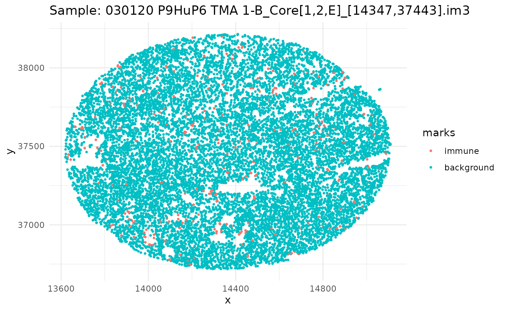
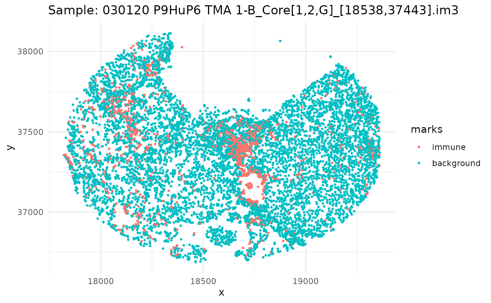
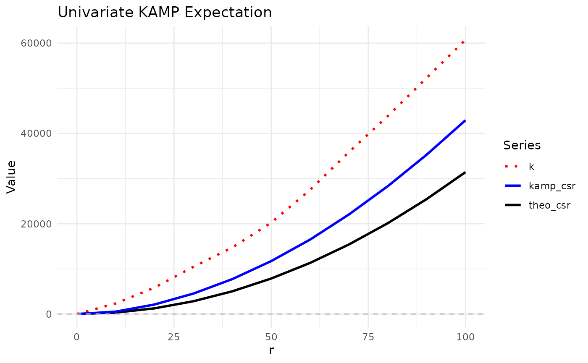
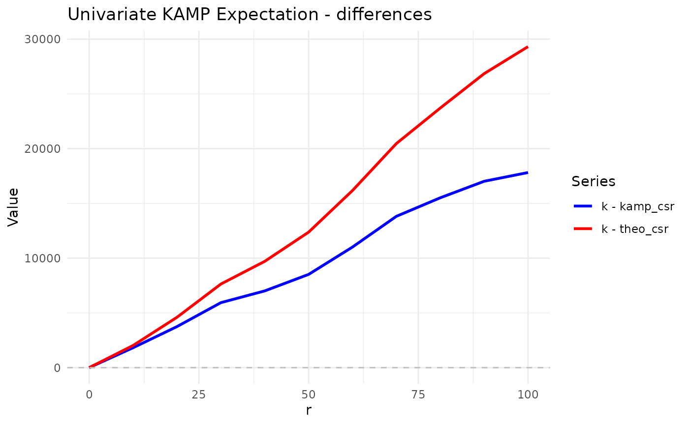
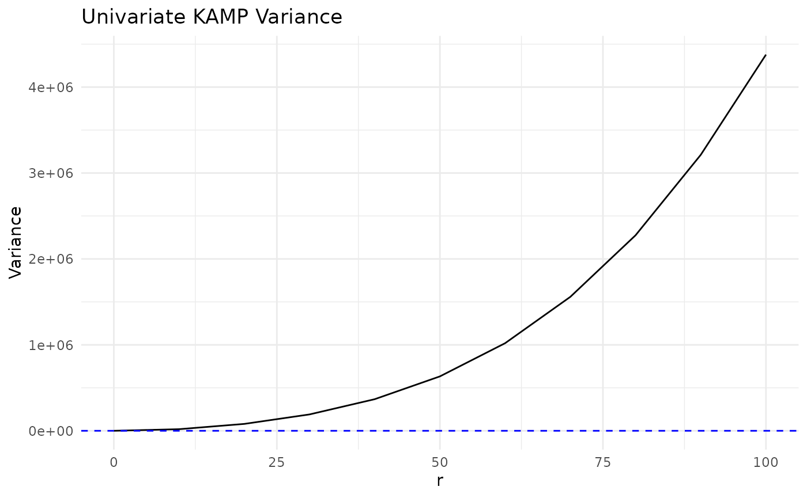
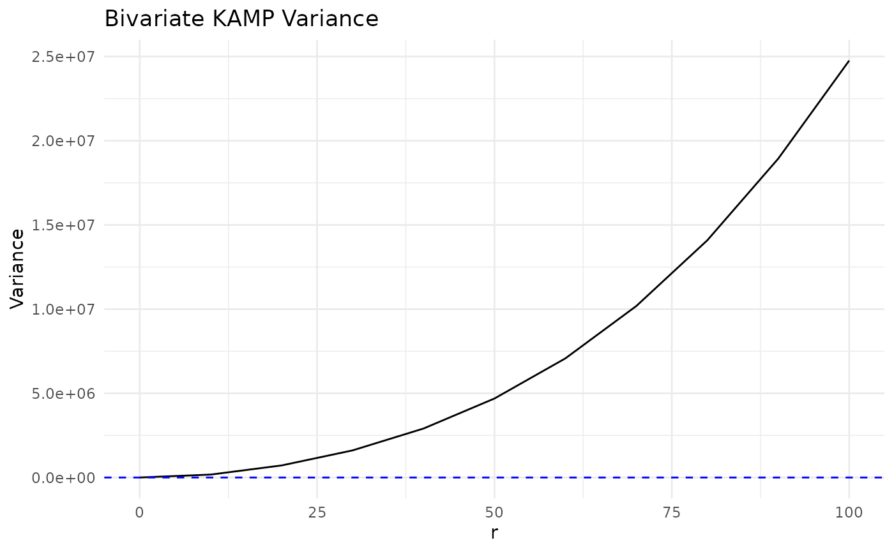
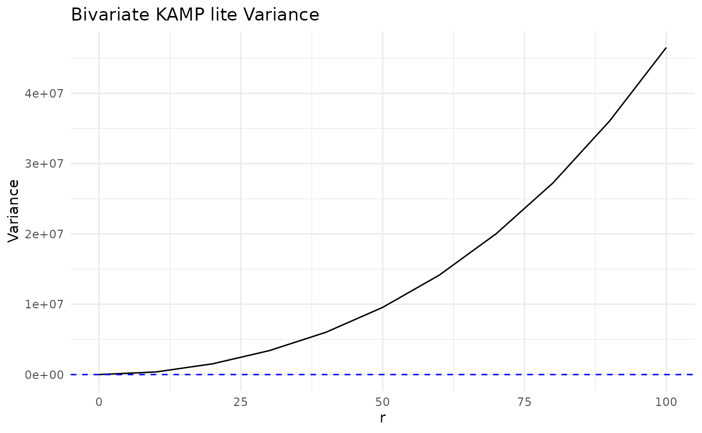

# KAMP

## Introduction

Hello and welcome to the `KAMP` package! This package is designed to
calculate the expectation and variance of KAMP (K adjustment by
Analytical Moments of the Permutation distribution) for point patterns
with marks. The package is partially built on the `spatstat` package,
which is a powerful tool for analyzing spatial data in R. The `KAMP`
package provides functions to simulate point patterns, calculate the
KAMP CSR, and visualize the results. The package is designed to be
user-friendly and easy to use, with a focus on providing clear and
concise output. The package is still in development, and we welcome any
feedback or suggestions for improvement. If you have any questions or
issues, please feel free to reach out to us.

## Setup

``` r

library(KAMP)
#library(devtools)
library(tidyverse)
#> ── Attaching core tidyverse packages ──────────────────────── tidyverse 2.0.0 ──
#> ✔ dplyr     1.2.1     ✔ readr     2.2.0
#> ✔ forcats   1.0.1     ✔ stringr   1.6.0
#> ✔ ggplot2   4.0.3     ✔ tibble    3.3.1
#> ✔ lubridate 1.9.5     ✔ tidyr     1.3.2
#> ✔ purrr     1.2.2     
#> ── Conflicts ────────────────────────────────────────── tidyverse_conflicts() ──
#> ✖ dplyr::filter() masks stats::filter()
#> ✖ dplyr::lag()    masks stats::lag()
#> ℹ Use the conflicted package (<http://conflicted.r-lib.org/>) to force all conflicts to become errors
library(spatstat.random)
#> Loading required package: spatstat.data
#> Loading required package: spatstat.univar
#> spatstat.univar 3.2-0
#> Loading required package: spatstat.geom
#> spatstat.geom 3.8-2
#> spatstat.random 3.5-1
#devtools::load_all()
set.seed(50)
```

## Ovarian Dataset

The `ovarian_df` dataset is a small dataframe that contains a snapshot
of 5 images of ovarian cancer cells from the `HumanOvarianCancerVP()`
dataset in the `VectraPolarisData` package. Each image is represented by
a unique sample ID, and within each image, there are multiple cells with
their respective x and y coordinates. The dataset includes an `immune`
column that indicates whether the cell is an immune cell or a background
cell. There is also a `phenotype` column that indicates the type of
immune cell, such as “helper t cells”, “cytotoxic t cells”, “b cells”,
or “macrophages”. The `x` and `y` columns represent the coordinates of
the cells in the image.

``` r

data(ovarian_df)
head(ovarian_df)
#>   cell_id                                           sample_id       x       y
#> 1       1 030120 P9HuP6 TMA 1-B_Core[1,1,H]_[20633,35348].im3 20592.9 34524.4
#> 2       2 030120 P9HuP6 TMA 1-B_Core[1,1,H]_[20633,35348].im3 20859.3 34524.4
#> 3       3 030120 P9HuP6 TMA 1-B_Core[1,1,H]_[20633,35348].im3 20591.4 34530.4
#> 4       4 030120 P9HuP6 TMA 1-B_Core[1,1,H]_[20633,35348].im3 20744.7 34528.9
#> 5       5 030120 P9HuP6 TMA 1-B_Core[1,1,H]_[20633,35348].im3 20419.8 34540.8
#> 6       6 030120 P9HuP6 TMA 1-B_Core[1,1,H]_[20633,35348].im3 20741.7 34542.3
#>       immune phenotype
#> 1 background     other
#> 2 background     other
#> 3 background     tumor
#> 4 background     tumor
#> 5 background     other
#> 6 background     tumor
```

Since we have a dataframe of multiple images, let’s go through, subset
our dataframe by id, and plot it.

``` r

ids <- unique(ovarian_df$sample_id)
mark_var <- "immune"

for (id in ids) {
  df_sub <- ovarian_df %>% filter(sample_id == id)
  w <- convexhull.xy(df_sub$x, df_sub$y)
  pp_obj <- ppp(df_sub$x, df_sub$y, window = w, marks = df_sub[[mark_var]])
  
  p <- ggplot(as_tibble(pp_obj), aes(x, y, color = marks)) +
    geom_point(size = 0.6) +
    labs(title = paste("Sample:", id)) +
    theme_minimal()
  
  print(p)
}
```



## KAMP

Now that we have our data, we can use the
[`kamp()`](https://dliao1.github.io/KAMP/reference/kamp.md) function to
calculate the KAMP expectation and variance for both univariate and
bivariate data.

### Univariate

We can use the
[`kamp()`](https://dliao1.github.io/KAMP/reference/kamp.md) function to
calculate the KAMP expectation for univariate data.

The [`kamp()`](https://dliao1.github.io/KAMP/reference/kamp.md) function
has several parameters that allow us to customize the calculation:

- `ppp_obj`: The point pattern object created using the
  [`ppp()`](https://rdrr.io/pkg/spatstat.geom/man/ppp.html) function
  from the `spatstat` package.

- `rvals`: A sequence of distances at which to calculate the K function.

- `univariate`: A logical value indicating whether to calculate the
  univariate K function (default is `TRUE`).

- `marks_var`: The name of the marks variable in the point pattern
  object (default is `"marks"`).

- `mark1`: The value of the marks variable for the first mark (required
  for univariate).

- `mark2`: The value of the marks variable for the second mark (optional
  for univariate).

- `variance`: A logical value indicating whether to calculate the
  variance (default is `FALSE`).

- `thin`: A logical value indicating whether to use thinning (default is
  `FALSE`).

- `p_thin`: Percentage to thin by (default is `0.5`).

For univariate data, we only need to specify one marks variable. In this
case, we set `univariate = TRUE` and `variance = FALSE` (the default).

- `univariate = TRUE` calculates the K function for one mark versus
  background.

- `variance = FALSE` means we only compute the expectation.

- `correction` uses translational correction by default.

#### Subsetting Data

To perform univariate analysis, we can subset our `ovarian_df` dataframe
to include only the first image ID and the `immune` marks variable.

``` r

ids <- unique(ovarian_df$sample_id)
univ_data <- ovarian_df %>% filter(sample_id == ids[1])
mark_var <- "immune"
head(univ_data)
#>   cell_id                                           sample_id       x       y
#> 1       1 030120 P9HuP6 TMA 1-B_Core[1,1,H]_[20633,35348].im3 20592.9 34524.4
#> 2       2 030120 P9HuP6 TMA 1-B_Core[1,1,H]_[20633,35348].im3 20859.3 34524.4
#> 3       3 030120 P9HuP6 TMA 1-B_Core[1,1,H]_[20633,35348].im3 20591.4 34530.4
#> 4       4 030120 P9HuP6 TMA 1-B_Core[1,1,H]_[20633,35348].im3 20744.7 34528.9
#> 5       5 030120 P9HuP6 TMA 1-B_Core[1,1,H]_[20633,35348].im3 20419.8 34540.8
#> 6       6 030120 P9HuP6 TMA 1-B_Core[1,1,H]_[20633,35348].im3 20741.7 34542.3
#>       immune phenotype
#> 1 background     other
#> 2 background     other
#> 3 background     tumor
#> 4 background     tumor
#> 5 background     other
#> 6 background     tumor
```

#### Expectation

We can now calculate the KAMP expectation for the univariate data using
the [`kamp()`](https://dliao1.github.io/KAMP/reference/kamp.md)
function. What we are doing here is calculating the KAMP expectation for
the `immune` marks variable against the background cells, using a
sequence of distances from 0 to 100 with a step of 10. Furthermore, we
use the option `univariate = TRUE` and specify the marks variable for
the first mark as `mark1 = "immune"` - we are not setting `mark2` since
we are only interested in the univariate case.

What’s returned is a data frame with the following columns:

- `r`: The distance at which the K function is calculated.

- `k`: The K function value.

- `theo_csr`: The theoretical CSR (Complete Spatial Randomness) value.

- `kamp_csr`: The KAMP CSR value.

- `kamp`: The difference between K and the KAMP CSR.

``` r

univ_kamp <- kamp(univ_data, 
                  rvals = seq(0, 100, by = 10),
                  univariate = TRUE,
                  mark_var = mark_var,
                  mark1 = "immune")
#> We expect the dataframe to be a single point process. If you have multiple point processes, subset the dataframe by ID and please run KAMP separately for each process.

univ_kamp
#> # A tibble: 11 × 5
#>        r      k theo_csr kamp_csr   kamp
#>    <dbl>  <dbl>    <dbl>    <dbl>  <dbl>
#>  1     0     0        0        0      0 
#>  2    10  2338.     314.     521.  1817.
#>  3    20  5855.    1257.    2108.  3747.
#>  4    30 10460.    2827.    4527.  5933.
#>  5    40 14735.    5027.    7727.  7008.
#>  6    50 20228.    7854.   11713.  8515.
#>  7    60 27485.   11310.   16472. 11013.
#>  8    70 35859.   15394.   22039. 13820.
#>  9    80 43814.   20106.   28302. 15511.
#> 10    90 52296.   25447.   35277. 17019.
#> 11   100 60732.   31416.   42914. 17818.
```

We can visualize KAMP using `ggplot2`. Plotted here is the original K
from translational edge correctionm, the theoretical CSR, and the KAMP
CSR. The KAMP CSR is the expected value of K under the null hypothesis
of CSR, which is calculated using the analytical moments of the
permutation distribution.

``` r

univ_kamp %>%
  ggplot(aes(x = r)) +
  geom_line(aes(y = theo_csr, color = "theo_csr", linetype = "theo_csr"), size = 1) +
  geom_line(aes(y = kamp_csr, color = "kamp_csr", linetype = "kamp_csr"), size = 1) +
  geom_line(aes(y = k, color = "k", linetype = "k"), size = 1) +
  geom_hline(yintercept = 0, linetype = "dashed", color = "gray") +
  scale_color_manual(
    values = c(
      "theo_csr" = "black",
      "kamp_csr" = "blue",
      "k" = "red"
    )
  ) +
  scale_linetype_manual(
    values = c(
      "theo_csr" = "solid",
      "kamp_csr" = "solid",
      "k" = "dotted"
    )
  ) +
  labs(
    title = "Univariate KAMP Expectation",
    x = "r",
    y = "Value",
    color = "Series",
    linetype = "Series"
  ) +
  theme_minimal()
#> Warning: Using `size` aesthetic for lines was deprecated in ggplot2 3.4.0.
#> ℹ Please use `linewidth` instead.
#> This warning is displayed once per session.
#> Call `lifecycle::last_lifecycle_warnings()` to see where this warning was
#> generated.
```



Looking at the plot, we can see that the KAMP CSR (blue line) is
slightly higher than the theoretical CSR (black line) at larger
distances. This result aligns with our expectations, as, if we view the
plots of the first sample image, the first image is more inhomogenous -
i.e. there are large holes/“patches” of empty space that could make the
immune cells appear more clustered than expected under CSR.

Let’s plot the differences between k and the theo_csr and kamp_csr to
get a better idea:

``` r

univ_kamp %>%
  ggplot(aes(x = r)) +
  geom_line(aes(y = k - kamp_csr, color = "k - kamp_csr", linetype = "k - kamp_csr"), size = 1) +
  geom_line(aes(y = k - theo_csr, color = "k - theo_csr", linetype = "k - theo_csr"), size = 1) +
  geom_hline(yintercept = 0, linetype = "dashed", color = "gray") +
  scale_color_manual(
    values = c(
      "k - theo_csr" = "red",
      "k - kamp_csr" = "blue"
    )
  ) +
  scale_linetype_manual(
    values = c(
      "k - theo_csr" = "solid",
      "k - kamp_csr" = "solid"
    )
  ) +
  labs(
    title = "Univariate KAMP Expectation - differences",
    x = "r",
    y = "Value",
    color = "Series",
    linetype = "Series"
  ) +
  theme_minimal()
```



As expected, the difference between k and the theoretical CSR values
tended to be higher than the difference between k and the KAMP CSR
values, indicating that the KAMP CSR seems to do a better job accounting
for the inhomogenous tissue quality.

#### Variance

To calculate the variance of the KAMP expectation, we still use the
kamp() function, but we set `variance = TRUE`. This will compute the
variance of the KAMP expectation at each distance `r`. The new output
will include all the same columns as before, but with additional column
`var` that contains the variance of the KAMP expectation at each
distance, and a `p-val` column that contains the p-value for the
variance test.

**Note:** `variance = TRUE` is not compatible with `thin = TRUE`. If
both are set to TRUE, a warning will be thrown and variance will still
be calculated, but the results may be unreliable.

``` r

univ_kamp_var <- kamp(univ_data,
                      rvals = seq(0, 100, by = 10),
                      univariate = TRUE,
                      mark_var = mark_var,
                      mark1 = "immune",
                      variance = TRUE)
#> We expect the dataframe to be a single point process. If you have multiple point processes, subset the dataframe by ID and please run KAMP separately for each process.
#>  ■■■■                               9% |  ETA:  2m
#>  ■■■■■■                            18% |  ETA:  1m
#>  ■■■■■■■■■                         27% |  ETA:  1m
#>  ■■■■■■■■■■■■                      36% |  ETA:  1m
#>  ■■■■■■■■■■■■■■■                   45% |  ETA: 46s
#>  ■■■■■■■■■■■■■■■■■                 55% |  ETA: 38s
#>  ■■■■■■■■■■■■■■■■■■■■              64% |  ETA: 30s
#>  ■■■■■■■■■■■■■■■■■■■■■■■           73% |  ETA: 23s
#>  ■■■■■■■■■■■■■■■■■■■■■■■■■■        82% |  ETA: 15s
#>  ■■■■■■■■■■■■■■■■■■■■■■■■■■■■      91% |  ETA:  7s
univ_kamp_var
#> # A tibble: 11 × 7
#>        r      k theo_csr kamp_csr   kamp      var     pvalue
#>    <dbl>  <dbl>    <dbl>    <dbl>  <dbl>    <dbl>      <dbl>
#>  1     0     0        0        0      0        0  NaN       
#>  2    10  2338.     314.     523.  1816.   18683.   1.43e-40
#>  3    20  5855.    1257.    2108.  3747.   80000.   2.30e-40
#>  4    30 10460.    2827.    4527.  5933.  190355.   2.03e-42
#>  5    40 14735.    5027.    7727.  7008.  367573.   3.34e-31
#>  6    50 20228.    7854.   11713.  8515.  633052.   4.99e-27
#>  7    60 27485.   11310.   16473. 11012. 1019381.   5.33e-28
#>  8    70 35859.   15394.   22040. 13819. 1558782.   8.92e-29
#>  9    80 43814.   20106.   28302. 15511. 2275297.   4.19e-25
#> 10    90 52296.   25447.   35277. 17019. 3211674.   1.09e-21
#> 11   100 60732.   31416.   42914. 17818. 4377696.   8.26e-18
```

We can visualize the variance of the KAMP expectation using `ggplot2`:

``` r

#devtools::load_all()

univ_kamp_var %>%
  ggplot(aes(x = r, y = var)) +
  geom_line() +
  geom_hline(yintercept = 0, linetype = "dashed", color = "blue") +
  labs(title = "Univariate KAMP Variance", x = "r", y = "Variance") +
  theme_minimal()
```



### Bivariate

#### Subsetting Data

For bivariate analysis, we can subset our `ovarian_df` dataframe to
include two types of immune cells and background cells. In this example,
we will use “helper t cells” and “cytotoxic t cells”.

``` r

ids <- unique(ovarian_df$sample_id)
biv_data <- ovarian_df %>% 
  filter(sample_id == ids[1]) #%>%
#filter(phenotype %in% c("helper t cells", "cytotoxic t cells", "other")) %>%
#droplevels()

mark_var <- "phenotype"

head(biv_data)
#>   cell_id                                           sample_id       x       y
#> 1       1 030120 P9HuP6 TMA 1-B_Core[1,1,H]_[20633,35348].im3 20592.9 34524.4
#> 2       2 030120 P9HuP6 TMA 1-B_Core[1,1,H]_[20633,35348].im3 20859.3 34524.4
#> 3       3 030120 P9HuP6 TMA 1-B_Core[1,1,H]_[20633,35348].im3 20591.4 34530.4
#> 4       4 030120 P9HuP6 TMA 1-B_Core[1,1,H]_[20633,35348].im3 20744.7 34528.9
#> 5       5 030120 P9HuP6 TMA 1-B_Core[1,1,H]_[20633,35348].im3 20419.8 34540.8
#> 6       6 030120 P9HuP6 TMA 1-B_Core[1,1,H]_[20633,35348].im3 20741.7 34542.3
#>       immune phenotype
#> 1 background     other
#> 2 background     other
#> 3 background     tumor
#> 4 background     tumor
#> 5 background     other
#> 6 background     tumor
```

#### Expectation

To calculate the KAMP expectation for bivariate data, we set
`univariate = FALSE` and specify the marks variables for both marks.

``` r


biv_kamp <- kamp(df = biv_data,
                 rvals = seq(0, 100, by = 10),
                 univariate = FALSE,
                 mark_var = mark_var,
                 mark1 = "helper t cell",
                 mark2 = "cytotoxic t cell")
#> We expect the dataframe to be a single point process. If you have multiple point processes, subset the dataframe by ID and please run KAMP separately for each process.
head(biv_kamp)
#> # A tibble: 6 × 5
#>       r      k theo_csr kamp_csr  kamp
#>   <dbl>  <dbl>    <dbl>    <dbl> <dbl>
#> 1     0     0        0        0     0 
#> 2    10   663.     314.     521.  142.
#> 3    20  2667.    1257.    2108.  559.
#> 4    30  7386.    2827.    4527. 2859.
#> 5    40  8745.    5027.    7727. 1017.
#> 6    50 13191.    7854.   11713. 1478.
```

``` r

biv_kamp %>%
  ggplot(aes(x = r)) +
  geom_line(aes(y = theo_csr, color = "theo_csr", linetype = "theo_csr"), size = 1) +
  geom_line(aes(y = kamp, color = "kamp", linetype = "kamp"), size = 1) +
  geom_line(aes(y = k, color = "k", linetype = "k"), size = 1) +
  geom_hline(yintercept = 0, linetype = "dashed", color = "gray") +
  scale_color_manual(
    values = c(
      "theo_csr" = "black",
      "kamp" = "blue",
      "k" = "red"
    )
  ) +
  scale_linetype_manual(
    values = c(
      "theo_csr" = "solid",
      "kamp" = "dotted",
      "k" = "dotted"
    )
  ) +
  labs(
    title = "Bivariate KAMP Expectation",
    x = "r",
    y = "Value",
    color = "Series",
    linetype = "Series"
  ) +
  theme_minimal()
```


#### Variance

``` r

biv_kamp_var <- kamp(df = biv_data,
                     rvals = seq(0, 100, by = 10),
                     univariate = FALSE,
                     mark_var = mark_var,
                     mark1 = "helper t cell",
                     mark2 = "cytotoxic t cell",
                     variance = TRUE)
#> We expect the dataframe to be a single point process. If you have multiple point processes, subset the dataframe by ID and please run KAMP separately for each process.
#>  ■■■■                               9% |  ETA:  1m
#>  ■■■■■■                            18% |  ETA:  1m
#>  ■■■■■■■■■                         27% |  ETA:  1m
#>  ■■■■■■■■■■■■                      36% |  ETA:  1m
#>  ■■■■■■■■■■■■■■■                   45% |  ETA: 44s
#>  ■■■■■■■■■■■■■■■■■                 55% |  ETA: 36s
#>  ■■■■■■■■■■■■■■■■■■■■              64% |  ETA: 29s
#>  ■■■■■■■■■■■■■■■■■■■■■■■           73% |  ETA: 22s
#>  ■■■■■■■■■■■■■■■■■■■■■■■■■■        82% |  ETA: 14s
#>  ■■■■■■■■■■■■■■■■■■■■■■■■■■■■      91% |  ETA:  7s
head(biv_kamp_var)
#> # A tibble: 6 × 7
#>       r      k theo_csr kamp_csr  kamp      var   pvalue
#>   <dbl>  <dbl>    <dbl>    <dbl> <dbl>    <dbl>    <dbl>
#> 1     0     0        0        0     0        0  NaN     
#> 2    10   663.     314.     523.  140.  173055.   0.368 
#> 3    20  2667.    1257.    2108.  559.  716375.   0.255 
#> 4    30  7386.    2827.    4527. 2859. 1609555.   0.0121
#> 5    40  8745.    5027.    7727. 1017. 2907985.   0.275 
#> 6    50 13191.    7854.   11713. 1478. 4691046.   0.248
```

``` r

biv_kamp_var %>%
  ggplot(aes(x = r, y = var)) +
  geom_line() +
  geom_hline(yintercept = 0, linetype = "dashed", color = "blue") +
  labs(title = "Bivariate KAMP Variance", x = "r", y = "Variance") +
  theme_minimal()
```



## KAMP-lite (Thinning)

KAMP-lite refers to running KAMP with a thinned point pattern using
`thin = TRUE` and specifying `p_thin` between 0 and 1. This helps with
performance on large datasets.

### Univariate

#### Expectation

``` r

ids <- unique(ovarian_df$sample_id)
mark_var <- "immune"
univ_data <- ovarian_df %>% filter(sample_id == ids[1])

univ_kamp_lite <- kamp(df = univ_data,
                       rvals = seq(0, 100, by = 10),
                       univariate = TRUE,
                       mark_var = mark_var,
                       mark1 = "immune",
                       thin = TRUE,
                       p_thin = 0.3)
#> We expect the dataframe to be a single point process. If you have multiple point processes, subset the dataframe by ID and please run KAMP separately for each process.
univ_kamp_lite
#> # A tibble: 11 × 5
#>        r      k theo_csr kamp_csr   kamp
#>    <dbl>  <dbl>    <dbl>    <dbl>  <dbl>
#>  1     0     0        0        0      0 
#>  2    10  2162.     314.     524.  1638.
#>  3    20  5468.    1257.    2118.  3350.
#>  4    30  9179.    2827.    4499.  4680.
#>  5    40 13995.    5027.    7664.  6331.
#>  6    50 19611.    7854.   11600.  8011.
#>  7    60 26824.   11310.   16325. 10499.
#>  8    70 35349.   15394.   21893. 13456.
#>  9    80 43318.   20106.   28137. 15181.
#> 10    90 51432.   25447.   35125. 16307.
#> 11   100 59610.   31416.   42752. 16858.
```

``` r

univ_kamp_lite %>%
  ggplot(aes(x = r)) +
  geom_line(aes(y = theo_csr, color = "theo_csr", linetype = "theo_csr"), size = 1) +
  geom_line(aes(y = kamp, color = "kamp", linetype = "kamp"), size = 1) +
  geom_line(aes(y = k, color = "k", linetype = "k"), size = 1) +
  geom_hline(yintercept = 0, linetype = "dashed", color = "gray") +
  scale_color_manual(
    values = c(
      "theo_csr" = "black",
      "kamp" = "blue",
      "k" = "red"
    )
  ) +
  scale_linetype_manual(
    values = c(
      "theo_csr" = "solid",
      "kamp" = "dotted",
      "k" = "dotted"
    )
  ) +
  labs(
    title = "Univariate KAMP-lite Expectation",
    x = "r",
    y = "Value",
    color = "Series",
    linetype = "Series"
  ) +
  theme_minimal()
```


#### Variance

``` r

univ_kamp_lite_var <- kamp(df = univ_data,
                           rvals = seq(0, 100, by = 10),
                           univariate = TRUE,
                           mark_var = mark_var,
                           mark1 = "immune",
                           thin = TRUE,
                           p_thin = 0.3,
                           variance = TRUE) # should display a warning message
#> We expect the dataframe to be a single point process. If you have multiple point processes, subset the dataframe by ID and please run KAMP separately for each process.
#> Variance calculation is not supported with KAMP lite
#> Variance calculation with KAMP lite is not recommended. Variance will still be computed, but interpret with caution.
#>  ■■■■                               9% |  ETA: 33s
#>  ■■■■■■                            18% |  ETA: 31s
#>  ■■■■■■■■■                         27% |  ETA: 28s
#>  ■■■■■■■■■■■■                      36% |  ETA: 24s
#>  ■■■■■■■■■■■■■■■                   45% |  ETA: 21s
#>  ■■■■■■■■■■■■■■■■■                 55% |  ETA: 17s
#>  ■■■■■■■■■■■■■■■■■■■■              64% |  ETA: 14s
#>  ■■■■■■■■■■■■■■■■■■■■■■■           73% |  ETA: 10s
#>  ■■■■■■■■■■■■■■■■■■■■■■■■■■        82% |  ETA:  7s
#>  ■■■■■■■■■■■■■■■■■■■■■■■■■■■■      91% |  ETA:  4s
univ_kamp_lite_var
#> # A tibble: 11 × 7
#>        r      k theo_csr kamp_csr   kamp      var     pvalue
#>    <dbl>  <dbl>    <dbl>    <dbl>  <dbl>    <dbl>      <dbl>
#>  1     0     0        0        0      0        0  NaN       
#>  2    10  1964.     314.     530.  1434.   41463.   9.52e-13
#>  3    20  6079.    1257.    2112.  3968.  172314.   5.98e-22
#>  4    30 11184.    2827.    4538.  6647.  399411.   3.61e-26
#>  5    40 16411.    5027.    7745.  8666.  744554.   4.91e-24
#>  6    50 20947.    7854.   11735.  9212. 1239598.   6.46e-17
#>  7    60 27720.   11310.   16462. 11258. 1928490.   2.60e-16
#>  8    70 35789.   15394.   22025. 13764. 2869955.   2.24e-16
#>  9    80 43263.   20106.   28282. 14981. 4070528.   5.63e-14
#> 10    90 51724.   25447.   35275. 16449. 5615689.   1.94e-12
#> 11   100 60087.   31416.   42967. 17120. 7546680.   2.30e-10
```

### Bivariate

``` r

ids <- unique(ovarian_df$sample_id)
biv_data <- ovarian_df %>% 
  filter(sample_id == ids[1]) #%>%
#filter(phenotype %in% c("helper t cell", "cytotoxic t cell", "other")) %>%
#droplevels()

mark_var <- "phenotype"

head(biv_data)
#>   cell_id                                           sample_id       x       y
#> 1       1 030120 P9HuP6 TMA 1-B_Core[1,1,H]_[20633,35348].im3 20592.9 34524.4
#> 2       2 030120 P9HuP6 TMA 1-B_Core[1,1,H]_[20633,35348].im3 20859.3 34524.4
#> 3       3 030120 P9HuP6 TMA 1-B_Core[1,1,H]_[20633,35348].im3 20591.4 34530.4
#> 4       4 030120 P9HuP6 TMA 1-B_Core[1,1,H]_[20633,35348].im3 20744.7 34528.9
#> 5       5 030120 P9HuP6 TMA 1-B_Core[1,1,H]_[20633,35348].im3 20419.8 34540.8
#> 6       6 030120 P9HuP6 TMA 1-B_Core[1,1,H]_[20633,35348].im3 20741.7 34542.3
#>       immune phenotype
#> 1 background     other
#> 2 background     other
#> 3 background     tumor
#> 4 background     tumor
#> 5 background     other
#> 6 background     tumor
```

#### Expectation

``` r

biv_kamp_lite <- kamp(df = biv_data,
                      rvals = seq(0, 100, by = 10),
                      univariate = FALSE,
                      mark_var = mark_var,
                      mark1 = "helper t cell",
                      mark2 = "cytotoxic t cell",
                      thin = TRUE,
                      p_thin = 0.3)
#> We expect the dataframe to be a single point process. If you have multiple point processes, subset the dataframe by ID and please run KAMP separately for each process.
head(biv_kamp_lite)
#> # A tibble: 6 × 5
#>       r      k theo_csr kamp_csr  kamp
#>   <dbl>  <dbl>    <dbl>    <dbl> <dbl>
#> 1     0     0        0        0     0 
#> 2    10   759.     314.     528.  231.
#> 3    20  3830.    1257.    2115. 1715.
#> 4    30 10028.    2827.    4543. 5484.
#> 5    40 10028.    5027.    7720. 2308.
#> 6    50 13948.    7854.   11725. 2223.
```

``` r

biv_kamp_lite %>%
  ggplot(aes(x = r)) +
  geom_line(aes(y = theo_csr, color = "theo_csr", linetype = "theo_csr"), size = 1) +
  geom_line(aes(y = kamp, color = "kamp", linetype = "kamp"), size = 1) +
  geom_line(aes(y = k, color = "k", linetype = "k"), size = 1) +
  geom_hline(yintercept = 0, linetype = "dashed", color = "gray") +
  scale_color_manual(
    values = c(
      "theo_csr" = "black",
      "kamp" = "blue",
      "k" = "red"
    )
  ) +
  scale_linetype_manual(
    values = c(
      "theo_csr" = "solid",
      "kamp" = "dotted",
      "k" = "dotted"
    )
  ) +
  labs(
    title = "Bivariate KAMP-lite Expectation",
    x = "r",
    y = "Value",
    color = "Series",
    linetype = "Series"
  ) +
  theme_minimal()
```


#### Variance

``` r

biv_kamp_lite_var <- kamp(df = biv_data,
                          rvals = seq(0, 100, by = 10),
                          univariate = FALSE,
                          mark_var = mark_var,
                          mark1 = "helper t cell",
                          mark2 = "cytotoxic t cell",
                          variance = TRUE,
                          thin = TRUE,
                          p_thin = 0.3) # should display a warning message
#> We expect the dataframe to be a single point process. If you have multiple point processes, subset the dataframe by ID and please run KAMP separately for each process.
#> Variance calculation is not supported with KAMP lite
#> Variance calculation with KAMP lite is not recommended. Variance will still be computed, but interpret with caution.
#>  ■■■■                               9% |  ETA: 37s
#>  ■■■■■■                            18% |  ETA: 35s
#>  ■■■■■■■■■                         27% |  ETA: 30s
#>  ■■■■■■■■■■■■                      36% |  ETA: 26s
#>  ■■■■■■■■■■■■■■■                   45% |  ETA: 23s
#>  ■■■■■■■■■■■■■■■■■                 55% |  ETA: 19s
#>  ■■■■■■■■■■■■■■■■■■■■              64% |  ETA: 15s
#>  ■■■■■■■■■■■■■■■■■■■■■■■           73% |  ETA: 11s
#>  ■■■■■■■■■■■■■■■■■■■■■■■■■■        82% |  ETA:  7s
#>  ■■■■■■■■■■■■■■■■■■■■■■■■■■■■      91% |  ETA:  4s
head(biv_kamp_lite_var)
#> # A tibble: 6 × 7
#>       r      k theo_csr kamp_csr   kamp      var  pvalue
#>   <dbl>  <dbl>    <dbl>    <dbl>  <dbl>    <dbl>   <dbl>
#> 1     0     0        0        0     0         0  NaN    
#> 2    10     0      314.     524. -524.   366275.   0.807
#> 3    20  2104.    1257.    2138.  -33.3 1523941.   0.511
#> 4    30  6365.    2827.    4609. 1756.  3399440.   0.170
#> 5    40  7795.    5027.    7830.  -35.1 6014528.   0.506
#> 6    50 14284.    7854.   11862. 2422.  9554116.   0.217
```

``` r

biv_kamp_lite_var %>%
  ggplot(aes(x = r, y = var)) +
  geom_line() +
  geom_hline(yintercept = 0, linetype = "dashed", color = "blue") +
  labs(title = "Bivariate KAMP lite Variance", x = "r", y = "Variance") +
  theme_minimal()
```


